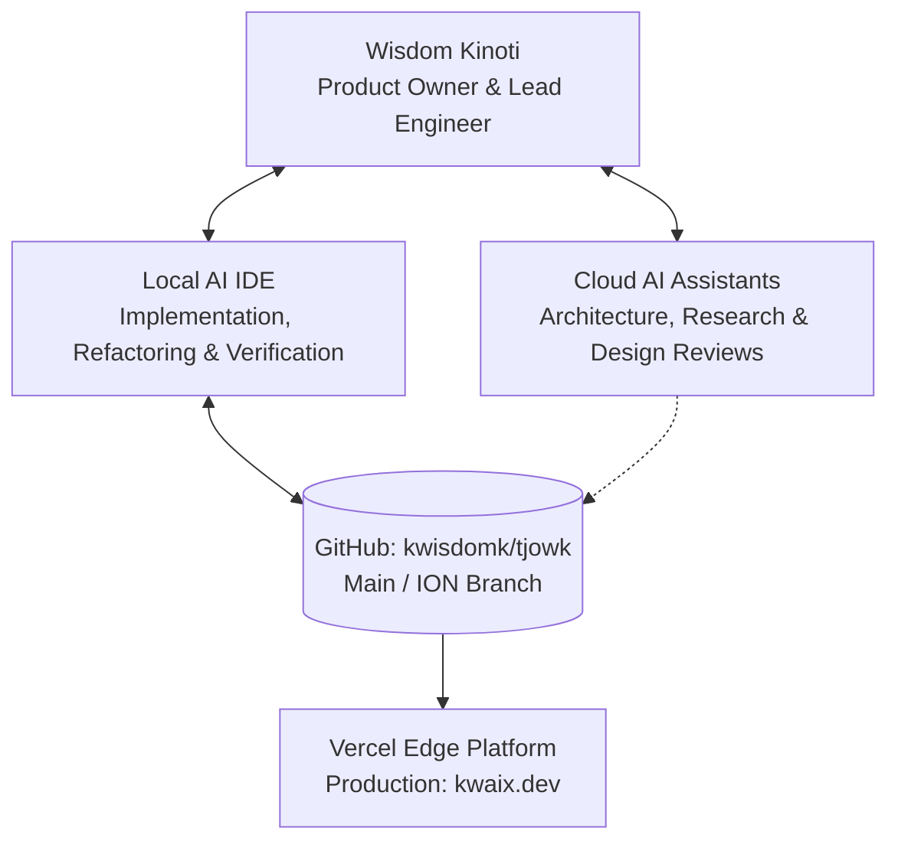

# Chapter 1: What is KWAIX?

> *"I blueprint things before they escape. Most of them turn into something real."*  
> — Wisdom Kinoti

---

## 1. Purpose

This chapter explains what **KWAIX.dev** is, why it exists, who created it, and what philosophy drives every technical and design decision in the repository.

If you are a new collaborator, an AI assistant, or Wisdom returning to this codebase after months away, read this chapter first to understand the soul and standard of the project.

---

## 2. Explanation

### What KWAIX is (and what it is not)

| What KWAIX is NOT | What KWAIX IS |
|---|---|
| A generic personal resume | A **self-updating technical autobiography system** |
| A flashy marketing landing page | A **living proof engine with engineering traceability** |
| An agency showcase with dummy mockups | An **honest log of shipped systems, active experiments, and abandoned prototypes** |
| A static CV updated once a year | A **continuous record of operational capability** |

KWAIX is built around a single non-negotiable principle:

> **"Everything I build is valid as long as it reflects progression."**

Many developers hide their early projects, failed experiments, or messy scripts. KWAIX takes the opposite approach: every step of the journey is recorded in the timeline. Abandoned projects are marked as `archived`—they are **never deleted**. Incomplete certifications are marked as `in-progress` with their real progress percentage.

---

## 3. The Operator

The human behind KWAIX is **Wisdom Kinoti**:

- **Roles:** Junior Cybersecurity Analyst · Computer Science Student · IBM i3 Intern (2026)
- **Location:** Nairobi, Kenya (UTC+3)
- **Focus Areas:** Systems Architecture, Security Operations, Industrial Digital Twins (OpenShift / MAS 9.1), Agentic AI Systems, Applied Cryptography
- **Primary Workstation:** Athena (HP Victus 15 — AMD Ryzen 5, 16GB RAM, RTX 3050)
- **GitHub Handles:** `kwisdomk` (primary identity) · `6ofHertz` (secondary/systems)

### What `φιλόσοφος` Means
Across the platform and metadata, you will see the Greek title **φιλόσοφος** (*philosophos* — "lover of wisdom").

This is not a decorative handle. It represents an engineering mindset:
1. **First-Principles Thinking:** Understanding how protocols, kernels, networks, and language models work from the byte level up, rather than treating them as black boxes.
2. **Systems Over Tools:** Tools change rapidly; foundational principles of systems engineering, threat modeling, and state management endure.
3. **Continuous Inquiry:** Building systems to learn how they fail, how they behave under load, and how to defend them.

---

## 4. The Origin & Project ION

KWAIX has evolved through distinct generations:

1. **Biblitheca / Genesis:** Early personal hub experiments and basic portfolio templates.
2. **The Journey (v2.0):** Establishing the flat-file content architecture, timeline spine, and dark mode aesthetic.
3. **Project ION (Current Era):** The comprehensive engineering overhaul chartered in mid-2026 to transform KWAIX from a basic website into a **premium engineering platform** with zero compromise on authenticity.

### The Project ION Core Decision Test
Whenever evaluating any feature, layout change, or styling tweak on the `ion` branch, apply this test:

> **"Does this make the engineering evidence clearer?"**  
> - If **yes** → Keep it and refine it.  
> - If it is **only prettier** without adding clarity → Question it, simplify it, or discard it.

---

## 5. Collaborative Engineering Model

KWAIX.dev is developed through a human-AI pair programming model:

- **Wisdom:** Drives vision, validates architecture, enforces cybersecurity rigor, and maintains content truth.
- **Local AI IDE:** Reads entire codebase context, handles structural refactoring, implements components, and executes builds and tests.
- **Cloud AI Assistants:** Assist with deep architectural reviews, design system tokenization, and algorithm optimization.
- **Future Developers:** Can inspect the codebase, read this Hackbook, and immediately contribute without onboarding friction.

---

## 6. Files Involved

The core identity and vision files live here:

| File | What it does |
|---|---|
| `content/profile.json` | Stores the single source of truth for name, alias, bio, quote, and links |
| `content/status.json` | Stores the active operational state (current build, secondary focus, uptime) |
| `lib/content/_rules.ts` | The data integrity contract enforcing truthfulness and consistency |
| `docs/plans/project-ion-charter.md` | The foundational charter for the ION engineering standard |

---

## 7. Examples in Action

### Example 1: The Tagline Quote
When you see the tagline:
> *"I blueprint things before they escape. Most of them turn into something real."*

It is stored once in `content/profile.json` under `"tagline"`. It is rendered dynamically on the homepage hero, in the site metadata for Google search results, and in the OpenGraph preview card shared on Twitter/LinkedIn.

### Example 2: Honest Timeline Record
In `content/timeline.json`, you will find entries for early 2024 university coursework (`OOP1`, `OOP-bcs`) sitting directly alongside enterprise 2026 milestones (`OTDT — Maximo Application Suite on OpenShift`). Nothing is hidden.

---

## 8. Common Mistakes

- **Mistake:** Adding promotional or "influencer-style" language ("Passionate full-stack guru with 100+ projects").  
  *Fix:* Use factual, understated language describing actual systems built, metrics verified, and roles held.
- **Mistake:** Deleting an old or incomplete project from the code.  
  *Fix:* Mark its status as `archived` in its project JSON file. The timeline preserves the entire progression.
- **Mistake:** Hardcoding identity details (like social links or bio text) inside a React component.  
  *Fix:* Always update `content/profile.json`. The components will automatically read from it.

---

## 9. Future Improvements

- **Mission Control (`/core`):** A planned telemetry dashboard displaying build status, repository health metrics, and infrastructure uptime.
- **Dynamic Research Index:** Unifying field notes from security labs and hardware telemetry into verified research whitepapers.

---

## 10. Related Chapters

- [Chapter 2: Architecture](02-architecture.md) — How Next.js turns this vision into code.
- [Chapter 3: Data Layer](03-data-layer.md) — Where `profile.json` and `status.json` live.
- [Chapter 11: Rules & Philosophy](11-rules-and-philosophy.md) — The 10 hard data rules.
