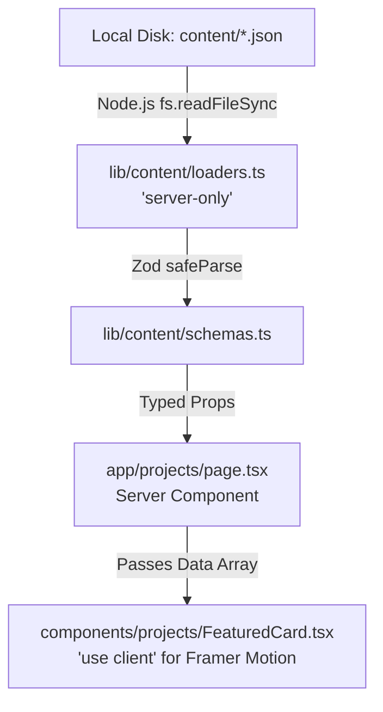
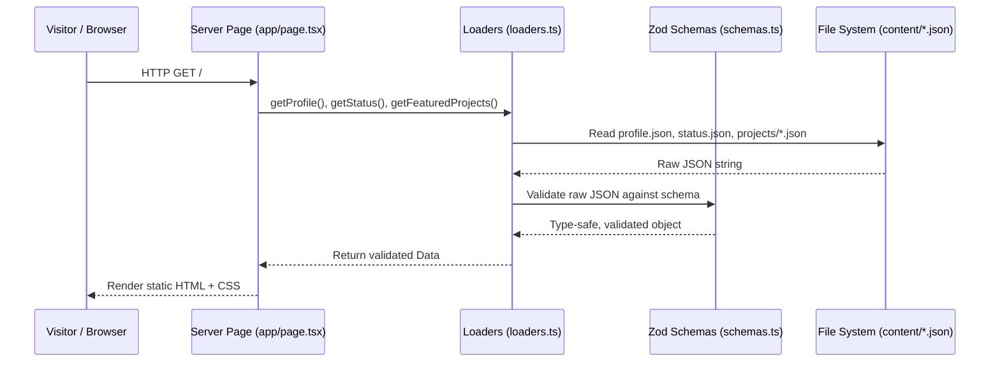

# Chapter 2: Architecture

> *"Simple systems fail in simple ways. Complex systems fail in complex ways."*

---

## 1. Purpose

This chapter explains how the software running KWAIX.dev is architected. It breaks down the technical stack, how data moves through the application, and how Next.js 16 turns raw files on disk into fast, secure web pages.

If you understand Linux, operating systems, or backend networking, this chapter will translate frontend concepts into systems terminology you already know.

---

## 2. Explanation

KWAIX.dev is built using **Next.js 16 (App Router)** and **TypeScript**, hosted on the **Vercel** edge network.

### The System Stack at a Glance

```
┌────────────────────────────────────────────────────────┐
│                   Vercel Edge Network                  │
├────────────────────────────────────────────────────────┤
│           Next.js 16 App Router (Node.js/Edge)         │
│  ┌──────────────────────────────────────────────────┐  │
│  │ Server Components (Layout, Static Pages, SSG)    │  │
│  └───────────────────────┬──────────────────────────┘  │
│                          │                             │
│                          ▼                             │
│  ┌──────────────────────────────────────────────────┐  │
│  │ Content Loaders (lib/content/loaders.ts)         │  │
│  └───────────────────────┬──────────────────────────┘  │
│                          │                             │
│                          ▼                             │
│  ┌──────────────────────────────────────────────────┐  │
│  │ Zod Schemas Validation (lib/content/schemas.ts)  │  │
│  └───────────────────────┬──────────────────────────┘  │
│                          │                             │
│                          ▼                             │
│  ┌──────────────────────────────────────────────────┐  │
│  │ Local JSON & Markdown Files (content/)           │  │
│  └──────────────────────────────────────────────────┘  │
└────────────────────────────────────────────────────────┘
```

---

## 3. Core Architectural Concepts

### A. Next.js App Router for Systems Engineers

In traditional web development, a server like Apache or Nginx routes incoming HTTP requests to specific scripts. In Next.js App Router, the filesystem *is* the router.

- Folders inside `app/` define the URL path.
- A file named `page.tsx` defines what gets rendered at that URL.

```
app/
├── layout.tsx                → The root frame (wraps all pages)
├── page.tsx                  → Renders https://kwaix.dev/
├── projects/
│   ├── page.tsx              → Renders https://kwaix.dev/projects
│   └── [id]/
│       └── page.tsx          → Renders https://kwaix.dev/projects/otdt, etc.
└── certs/
    └── page.tsx              → Renders https://kwaix.dev/certs
```

### B. Server Components vs Client Components

In Next.js 16, components are divided into two distinct execution environments:

| Type | Where it runs | Has access to | Use Case |
|---|---|---|---|
| **Server Component** (Default) | On the server during build or request | Local filesystem (`fs`), environment secrets, direct disk reads | Fetching data, generating static HTML, SEO metadata |
| **Client Component** (`'use client'`) | In the visitor's web browser | Mouse clicks, keyboard input, animations (`framer-motion`), `localStorage` | Interactive forms, theme toggles, modal dialogs, terminal |

#### The Golden Rule:
> **Keep data loading on the server. Only push to the client when user interaction is strictly required.**



### C. The `server-only` Security Boundary
In `lib/content/loaders.ts`, the very first line is:
```typescript
import 'server-only';
```
This is a compiler safeguard. If any developer or AI assistant accidentally tries to import file-system loaders into a Client Component (which would leak server code or fail in the browser), the build will fail immediately with a compilation error.

---

## 4. The One-Way Data Flow

Data in KWAIX flows in **one direction only**. The UI is a read-only projection of the files in `content/`.



1. **Content files (`content/`)** hold the raw facts (JSON and Markdown).
2. **Schemas (`lib/content/schemas.ts`)** define the shape of every fact.
3. **Loaders (`lib/content/loaders.ts`)** read the disk and validate the facts.
4. **Pages (`app/*/page.tsx`)** fetch the validated facts and assemble the layout.
5. **Components (`components/*`)** receive the facts as `props` and render HTML.

> **Crucial Rule:** Components *never* write to disk. There is no database write path at runtime.

---

## 5. The Component Hierarchy (Tree)

Every view on KWAIX is structured inside a nested hierarchy of components:

```
Root Layout (app/layout.tsx)
 │
 ├── ThemeProvider (next-themes)
 │    │
 │    ├── Navbar (components/layout/Navbar.tsx)
 │    │    ├── Logo & Title Link
 │    │    ├── Navigation Links (/projects, /about, /certs, /contact, /journal)
 │    │    ├── Live Status Pill (pulsing green dot)
 │    │    └── ThemeToggle (Dark / Light toggle)
 │    │
 │    ├── Page Content (e.g. app/page.tsx, app/projects/page.tsx)
 │    │    └── Child Page Components (IdentityBlock, CurrentOps, FeaturedCard...)
 │    │
 │    ├── Footer (components/layout/Footer.tsx)
 │    │    ├── Operational status info
 │    │    ├── Social / GitHub links
 │    │    └── System copyright & version
 │    │
 │    └── Floating Terminal Layer
 │         ├── TerminalButton (Floating prompt trigger at bottom right)
 │         └── Terminal Modal (components/ui/terminal.tsx)
```

---

## 6. Files Involved

| File | Role |
|---|---|
| `app/layout.tsx` | Root shell containing HTML headers, font loading, Navbar, Footer, and Terminal |
| `app/page.tsx` | Main landing transmission view |
| `lib/content/loaders.ts` | Backend disk reading and schema validation pipeline |
| `lib/content/schemas.ts` | Zod structural contracts for all data types |
| `lib/utils.ts` | Tailwind class merging utility (`cn` function) |

---

## 7. Common Mistakes

- **Mistake:** Adding `'use client'` to `app/page.tsx` or `app/projects/page.tsx`.  
  *Why it is bad:* It breaks server-side file reading and destroys SEO pre-rendering.  
  *Fix:* Keep the page as a Server Component. If a sub-element needs animation or click handlers, isolate that interactive part into a small Client Component in `components/`.
- **Mistake:** Importing Node.js `fs` or `path` directly inside a component in `components/`.  
  *Why it is bad:* Components should be pure presentation. All file operations belong in `lib/content/loaders.ts`.

---

## 8. Future Improvements

- **Static Generation Cache:** Pre-generating all Markdown AST tokens during build time to reduce page load latency to sub-10ms.
- **Incremental Static Regeneration (ISR):** If a CMS layer is added in the future, Next.js can re-validate pages in the background when GitHub webhooks trigger.

---

## 9. Related Chapters

- [Chapter 3: Data Layer](03-data-layer.md) — Detailed breakdown of every JSON and Markdown file.
- [Chapter 4: Pages](04-pages.md) — Breakdown of all page routes.
- [Chapter 5: Components](05-components.md) — In-depth component inventory.
