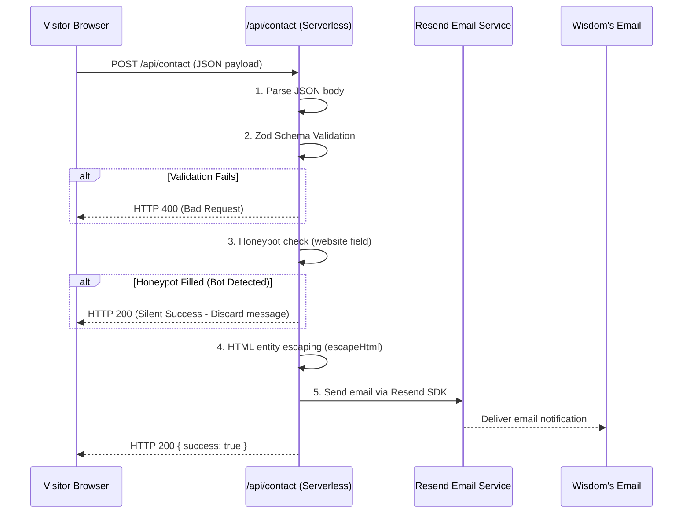

# Chapter 8: API & Backend

> *"A serverless backend has no persistent state, no open listening ports to maintain, and executes only when called."*

---

## 1. Purpose

This chapter explains the backend serverless endpoints powering KWAIX.dev. It breaks down how the contact form sends secure emails via Resend, and how the GitHub OAuth PKCE authentication flow works under the hood.

---

## 2. Serverless API Architecture

KWAIX does not maintain a long-running Node.js or Express server. Instead, it utilizes **Next.js Serverless Functions** hosted on Vercel:

```
┌────────────────────────────────────────────────────────┐
│ Incoming HTTP Request                                  │
├────────────────────────────────────────────────────────┤
│ Route: /api/contact      Route: /api/auth    /callback │
│  ┌─────────────────┐      ┌─────────────────────────┐  │
│  │ Resend Mailer   │      │ GitHub OAuth PKCE Flow  │  │
│  │ (Spam Protected)│      │ (Hardened CSP & Nonce)  │  │
│  └─────────────────┘      └─────────────────────────┘  │
└────────────────────────────────────────────────────────┘
```

---

## 3. The Contact Form Pipeline (`app/api/contact/route.ts`)

When a visitor submits the contact form on `/contact`, the request follows a strict security pipeline:



### Security Controls in the Contact Route:
1. **Zod Bounds:** Input lengths are strictly constrained (`name`: max 100 chars, `email`: max 254 chars, `message`: max 5000 chars) to prevent payload flooding.
2. **Honeypot Trap:** The form contains a hidden input field named `website`. Human users cannot see or fill this field. Automated spam scrapers fill every form field they find. If `website` contains any text, the API returns a silent `200 OK` and immediately drops the submission without sending an email.
3. **HTML Sanitization:** All text inputs are passed through `escapeHtml()` to replace characters (`<`, `>`, `&`, `"`, `'`) with safe HTML entities before being embedded into the email body, preventing HTML injection into Wisdom's email client.

---

## 4. GitHub OAuth PKCE Flow (`/api/auth` & `/api/callback`)

KWAIX contains a production-grade OAuth 2.0 PKCE implementation designed for authentication with GitHub.

### Why PKCE (RFC 7636)?
Traditional OAuth 2.0 flows rely on exchanging a client secret. **PKCE (Proof Key for Code Exchange)** enhances this by generating a cryptographically random `code_verifier` and deriving a SHA-256 `code_challenge` for each login attempt. This mathematically guarantees that authorization codes cannot be intercepted or replayed by malicious third parties.

### The Callback Route Security Hardening (`app/api/callback/route.ts`):
1. **State & Verifier Cookies:** Stored in `httpOnly`, `secure`, `sameSite: lax` cookies that expire after 10 minutes and are immediately destroyed upon completion.
2. **Strict Identity Verification:** After retrieving the user profile from GitHub, the API explicitly checks:
   ```typescript
   if (userData?.login !== "kwisdomk") {
     await revokeToken(clientId, clientSecret, accessToken);
     return errorResponse("Access denied");
   }
   ```
   If any other GitHub user attempts to authenticate, their access token is **immediately revoked** via GitHub's API, and access is denied.
3. **Nonce-based Content-Security-Policy (CSP):** The HTML response sets a strict zero-trust CSP header:
   ```http
   Content-Security-Policy: default-src 'none'; script-src 'nonce-{RANDOM_NONCE}'; ...
   ```

---

## 5. Required Environment Variables

To run the backend services, these variables must be configured in `.env.local` (for development) and in the Vercel Dashboard (for production):

| Variable | Purpose | Required For |
|---|---|---|
| `RESEND_API_KEY` | API token for Resend email delivery | `/api/contact` |
| `CONTACT_EMAIL` | The destination email where form messages are sent | `/api/contact` |
| `GITHUB_CLIENT_ID` | OAuth App ID registered with GitHub | `/api/auth` |
| `GITHUB_CLIENT_SECRET` | OAuth App Secret registered with GitHub | `/api/callback` |

---

## 6. Common Mistakes

- **Mistake:** Committing `.env.local` or real API keys to Git.  
  *Rule:* NEVER commit secret keys. Always verify that `.env.local` is listed in `.gitignore`.
- **Mistake:** Attempting to use Node.js filesystem (`fs`) in an edge-runtime API route.  
  *Fix:* Standard Node.js API routes run in the Node.js serverless runtime. Edge runtime routes cannot access the local disk.

---

## 7. Related Chapters

- [Chapter 4: Pages](04-pages.md) — The `/contact` page implementation.
- [Chapter 5: Components](05-components.md) — The `ContactForm` component.
- [Appendix C: Environment Variables](../appendices/environment-variables.md) — Full env var reference.
