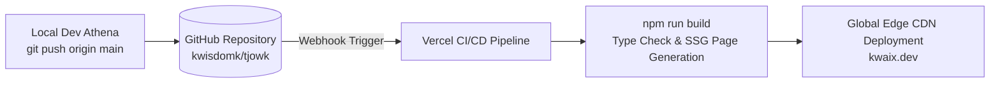

# Chapter 9: SEO & Infrastructure

> *"If a system is technically brilliant but invisible to search engines and unoptimized on the wire, its impact is halved."*

---

## 1. Purpose

This chapter explains the infrastructure, search engine optimization (SEO), social media preview cards, and deployment pipelines powering KWAIX.dev.

---

## 2. Dynamic OpenGraph Social Previews (`app/opengraph-image.tsx`)

When someone shares a link to `https://kwaix.dev` on Twitter, LinkedIn, Discord, or WhatsApp, a dynamic image is rendered in real time.

```
┌────────────────────────────────────────────────────────┐
│                                                        │
│  [KWAIX LOGO]   KWAIX Hub                              │
│                                                        │
│  Wisdom Kinoti · Junior Cybersecurity Analyst &        │
│  CS Student. Systems, AI, and Security.                │
│                                                        │
│  ┌─────────────────────────┐                           │
│  │ wisdom@kOS:~$ _         │                           │
│  └─────────────────────────┘                           │
└────────────────────────────────────────────────────────┘
```

### How it works technically:
1. **Edge Runtime:** Runs on Vercel's edge network using `export const runtime = 'edge'`.
2. **Satori Engine:** Uses `@vercel/og` to convert standard JSX into high-resolution SVG and PNG images (1200x630px) without requiring a headless browser (like Puppeteer).
3. **Sub-50ms Response:** Generated dynamically and cached at edge CDN locations globally.

---

## 3. Dynamic Sitemap & Robots Configuration

### A. Dynamic Sitemap (`app/sitemap.ts`)
Instead of maintaining a static XML file by hand, `sitemap.ts` automatically generates an updated sitemap whenever new content is added:
- Injects static routes (`/`, `/projects`, `/about`, `/certs`, `/contact`, `/journal`).
- Dynamically iterates through every project in `getProjects()` and adds `/projects/[id]` with appropriate priorities.
- Dynamically iterates through all posts in `getAllPosts()` and adds `/journal/[slug]`.

### B. Crawler Rules (`app/robots.ts`)
Tells search engine bots (Googlebot, Bingbot) what to index:
- **Allowed:** Public pages (`/`).
- **Disallowed:** Internal API routes (`/api/`) and private staging endpoints (`/private/`).
- **Sitemap Link:** Injects `https://kwaix.dev/sitemap.xml`.

---

## 4. Progressive Web App (PWA) Manifest (`app/manifest.ts`)

Defines how the site behaves when installed on mobile devices or desktop browsers (via "Add to Home Screen"):
- **Name:** `KWAIX Hub — Wisdom Kinoti`
- **Theme Color:** `#10b981` (Emerald)
- **Background Color:** `#09090b` (Deep Zinc)
- **Icons:** 192x192 and 512x512 PNG assets in `/public/icons/`.

---

## 5. Next.js Core Optimization (`next.config.ts`)

The production build is hardened with custom configurations:

```typescript
const nextConfig: NextConfig = {
  poweredByHeader: false,      // Removes "X-Powered-By: Next.js" header to avoid tech stack fingerprinting
  compress: true,               // Gzip & Brotli compression for assets
  images: {
    formats: ['image/avif', 'image/webp'], // Modern compressed image formats
  },
};
```

---

## 6. Hosting & Deployment Pipeline (Vercel)



- **Branch Deployment:** Pushing to `main` updates production immediately.
- **Preview Deployments:** Pushing to feature branches (like `ion`) generates unique preview URLs for testing before merging.

---

## 7. Common Mistakes

- **Mistake:** Forgetting to update canonical URLs in `sitemap.ts` when adding new top-level routes.  
  *Fix:* Add new permanent routes to the `staticRoutes` array in `app/sitemap.ts`.
- **Mistake:** Placing raw uncompressed 10MB PNGs in `/public/`.  
  *Fix:* Use modern formats (WebP/AVIF) and let Next.js `<Image />` optimize assets automatically.

---

## 8. Related Chapters

- [Chapter 4: Pages](04-pages.md) — How individual pages export metadata.
- [Chapter 8: API & Backend](08-api-and-backend.md) — Backend route protections.
