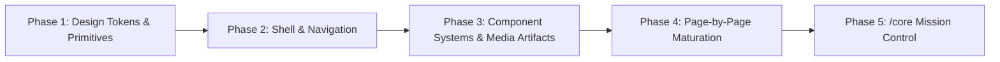

# Project ION — Engineering & Design System Charter

> **North Star:**  
> Transform **KWAIX.dev** from a technically correct portfolio into a **premium engineering platform** while preserving its evidence-first philosophy.

---

## 1. Core Decision Test

Whenever evaluating an architectural, layout, or visual design decision, ask:

> **"Does this make the engineering evidence clearer?"**
> - If **yes** → Keep it and refine it.
> - If it is **only prettier** → Question it, simplify it, or discard it.

---

## 2. Guiding Principles

### Principle 1: Evidence Over Aesthetics
Every visual element must reinforce proof, technical competence, and authenticity. Aesthetics exist to enhance credibility and readability, not to decorate empty space.

### Principle 2: Media Becomes Documentation
Screenshots, architecture diagrams, terminal sessions, and traces are not decorative gallery items. They are **engineering artifacts** that substantiate claims.

### Principle 3: Hierarchy Over Density
Retain technical depth and information richness, but structure scanning paths intentionally with deliberate typography, contrast, and spacing rhythm.

### Principle 4: Motion Serves Understanding
Animations must communicate state transitions, spatial continuity, or focus hierarchy. Zero motion for decoration alone; complete support for `prefers-reduced-motion`.

### Principle 5: Consistency Wins
One unified, rock-solid primitive (card, badge, surface, dialog) applied across all views is vastly superior to isolated bespoke designs.

---

## 3. Information Architecture — The Technical OS

Rather than presenting a generic personal website or unfocused "hub," KWAIX.dev structures its information architecture as a technical operating system:

| Section | Role & Scope |
|---|---|
| **Workloads** | Primary engineering builds, systems, and active technical projects (`/projects`). |
| **Research** | Deep-dive write-ups, security analyses, experiments, and technical journal logs (`/journal` / `/research`). |
| **Credentials** | Verified certifications, formal education, and structured learning tracks (`/certs` / `/credentials`). |
| **Identity** | Operating philosophy, engineering background, focus areas, and technical trajectory. |
| **Signal** | Public contact channels, encrypted communications, and collaboration avenues (`/contact` / `/signal`). |
| **Core** | Mission control, telemetry, metrics, and operational overview (`/core` — *deferred to final phase*). |

---

## 4. Phased Implementation Roadmap

### Phase 1 — Design System Primitives & Tokens
Establish the foundational tokens before touching application views:
- **Typography**: Refined scale, line heights, font pairings (Inter / JetBrains Mono / Geist), deliberate weights.
- **Surfaces & Elevation**: Cohesive dark/light palette, surface levels (`surface-1`, `surface-2`, `surface-3`), subtle glassmorphism with accessible contrast.
- **Borders & Dividers**: Crisp borders, subtle structural grid lines.
- **Interactive Primitives**: Buttons, segmented controls, badges, status chips, tooltips.
- **Layout Containers**: `site-shell`, unified max-widths, consistent vertical rhythms.
- **Motion Tokens**: Restrained durations (150ms–250ms), purposeful easing curves, full reduced-motion overrides.

### Phase 2 — Shell & Navigation
- Site header, responsive navigation, operator status indicator, command palette / terminal integration, theme switcher.
- Seamless skip-links, landmark regions, and keyboard-first navigation paths.

### Phase 3 — Media & Evidence Presentation System
- Reusable `ArtifactViewer` / `VisualGallery` supporting full-bleed lightboxes, zoom, metadata overlays, and architecture diagram inspections.
- Unified card system for Workloads, Research, and Timeline entries.

### Phase 4 — Page-by-Page Implementation Sequence
1. **Homepage** — Hero, Current Operations, Featured Workloads preview, Navigation matrix.
2. **Workloads Index (`/projects`)** — Filterable matrix, phase badges, tech stack tags, evidence previews.
3. **Workload Details (`/projects/[id]`)** — Immersive case study layout, problem/solution/architecture breakdown, artifact inspection, metrics.
4. **Credentials & Learning (`/certs`)** — Verified credentials, timeline continuity.
5. **Identity & Philosophy** — Authentic narrative, background, operator workstation.
6. **Signal (`/contact`)** — Hardened communication form, direct channels, PGP/verified keys.

### Phase 5 — Core (`/core`)
- Culminating operational interface built once the global design language, geometry wireframe, and canonical data mapping are fully mature and approved.
