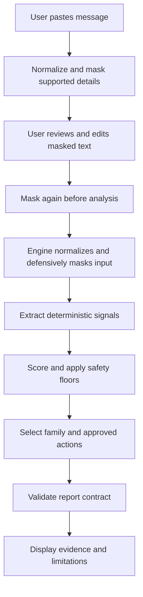

# SHADO — portfolio evidence review

Date: 2026-09-07
Status: source review complete; local execution and publication checks outstanding
Reviewed revision: `b2ae3372852e673faef9b3d196e57bc804339fd6`

## Decision

Use SHADO as the provisional first v3 case study. Its local rules, editable masking, report contract, and regression coverage provide a concrete security engineering story. This recommendation does not promote a project to public content or certify runtime behaviour.

The review combined a primary editorial pass with an independent read-only source review. No application, test, build, or browser verification was executed here. GitHub source evidence describes the reviewed revision, not unpublished local work.

## Claims and evidence

All links below are pinned to the reviewed revision.

| Proposed claim | Evidence | Publication qualification |
|---|---|---|
| Analysis uses local deterministic rules | [Analysis page](https://github.com/kwisdomk/shado/blob/b2ae3372852e673faef9b3d196e57bc804339fd6/src/app/analyze/page.tsx), [engine](https://github.com/kwisdomk/shado/blob/b2ae3372852e673faef9b3d196e57bc804339fd6/src/lib/engine.ts) | Supported by inspected call path; verify deployed behaviour separately. |
| Users can review and edit masked text | [Page](https://github.com/kwisdomk/shado/blob/b2ae3372852e673faef9b3d196e57bc804339fd6/src/app/analyze/page.tsx), [masker](https://github.com/kwisdomk/shado/blob/b2ae3372852e673faef9b3d196e57bc804339fd6/src/lib/pii-masker.ts) | Describe repeated masking without claiming an exact two-pass implementation. Page and engine together invoke masking three times on this path. |
| Reports explain matched indicators | [Engine](https://github.com/kwisdomk/shado/blob/b2ae3372852e673faef9b3d196e57bc804339fd6/src/lib/engine.ts), [schema](https://github.com/kwisdomk/shado/blob/b2ae3372852e673faef9b3d196e57bc804339fd6/src/lib/schema.ts) | Score is bounded 0–100 and explicitly not a fraud probability. Schema validity does not prove accuracy. |
| No runtime AI analysis is implemented | [Dependencies](https://github.com/kwisdomk/shado/blob/b2ae3372852e673faef9b3d196e57bc804339fd6/package.json), page and engine | Reserved AI-related schema values are not implemented features. Development-time AI assistance is a separate statement. |
| Message state is transient in the inspected path | Analysis page state definition and transitions | Raw input remains during review, analysis and error states for Back navigation. Do not claim immediate erasure after masking or physical memory zeroization. |
| Regression tests cover meaningful edge cases | [Engine tests](https://github.com/kwisdomk/shado/blob/b2ae3372852e673faef9b3d196e57bc804339fd6/src/lib/__tests__/engine.test.ts) | Covers benign controls, contextual false negatives, credentials, ambiguity, invalid input and determinism. Tests exist; their success was not verified in this review. |
| UI tests check privacy-related behaviours | [Flow tests](https://github.com/kwisdomk/shado/blob/b2ae3372852e673faef9b3d196e57bc804339fd6/src/app/__tests__/analyze-flow.test.tsx) | jsdom spies cover selected fetch/storage/logging behaviour; this is not comprehensive browser verification. |

## Evidence still missing

- Fresh clean-install, test, lint, and build results at a recorded commit and environment.
- Actual input → review → results screenshots and a narrow-screen check.
- Browser network, storage, and URL observations during analysis.
- Keyboard, focus, mobile keyboard, and screen-reader checks.
- Confirmation of Wisdom's personal contribution, inherited work, and AI-assisted development role before first-person copy.

The Actions API returned zero workflow runs during this review. This is not a test failure and does not exclude local verification elsewhere; it means no Actions execution evidence was available here.

The tree entries `docs/Screenshot 2026-07-15 151642.png` and `public/logo.png` have the same blob SHA. A screenshot-like filename is therefore not evidence of an application journey. Capture fresh runtime media.

## Claims excluded from the draft

Guaranteed fraud detection; measured real-world accuracy; complete name/PII masking; certified security or privacy; immediate memory erasure; fully offline/PWA support; SMS inbox access; runtime AI analysis; automatic blocking or reporting; CI-verified readiness.

## Proposed explanatory architecture

This diagram explains inspected source structure. It is not an execution trace or screenshot.

## Release gate

Ready for case-study drafting. Publication gate remains open until the local evidence assignment is returned. Use factual third-person copy until personal attribution is confirmed. If the tested revision changes, reconcile this review and the draft against that revision.
